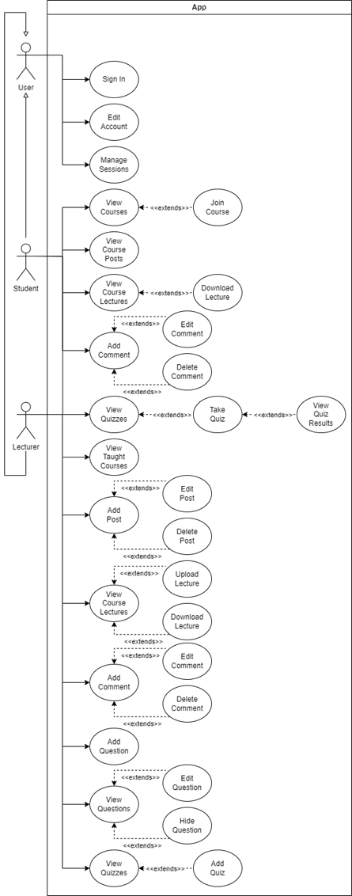
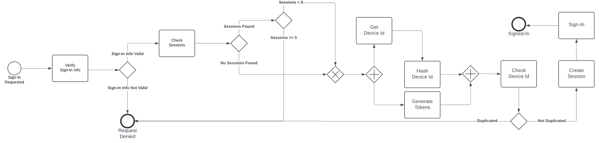
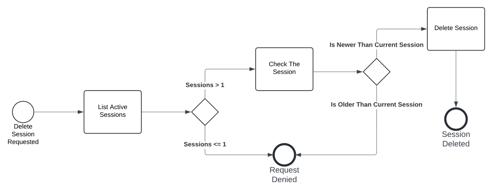
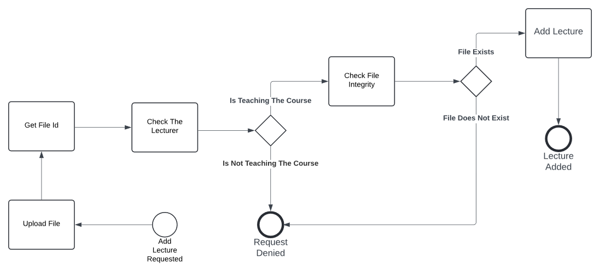
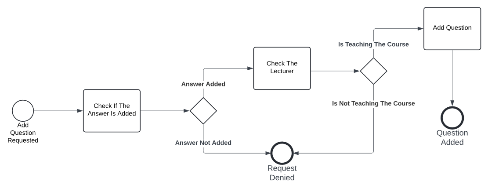
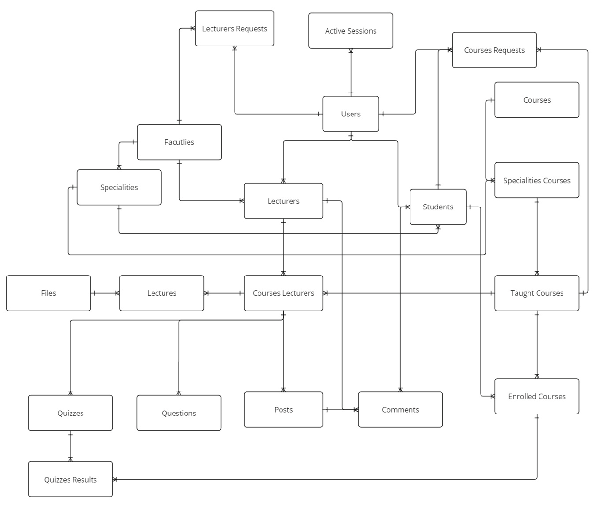

# Project for university

Rest API project for university, that emluate university system):
<br/>

## Running on:

* Windows 11

* Python 3.11.4 or higher

* PostgreSQL

## How to run

### Install from git:

#### Using GitFlic:

```shell
$ git clone https://gitflic.ru/project/abstract-333/university-api.git

$ cd university-api
```

#### Using GitHub:

```shell
$ git clone https://github.com/abstract-333/university-api.git

$ cd university-api
```

### Create and activate virutal environment:

```shell
$ python -m venv .venv

$ .\.venv\Scripts\activate
```

### Install dependencies:

```shell
$ pip install -r requirements.txt
```

### Make migration for database:

_<strong>
First Create database under "name".
<br>
Add this name and other properties to .env.prod file.
</strong>_
<br>
<br>

```shell
$ alembic upgrade heads
```

### Run App:

* #### Using Make:

```shell
$ make run
```

* #### Without Make:

```shell
$ uvicorn --factory src.app:app --reload
```

## Description:

This project has been developed as an alternative to the Moodle LMS system, as it creates a complete interactive
environment
for the university.
This system include wide range of features such as:

* **Courses**: Create courses, add lectures there, questions and posts about the course, so it provides tools for easily
  creating and managing educational content.
* **Interaction Between Students and Instructors**: Enabling effective communication through forums, chats, and
  messaging.
* **Assessments and Exams**: Offering tools for designing tests and evaluating student performance.
* **Data Analysis**: Utilizing data to analyze student performance and improve the educational process.
* **Personalization of the Learning Experience**: The ability to customize content and resources based on **_students'_
  **
  needs.

### Use Case Diagram:



### Sign-in BPMN:



### Delete Session BPMN:



### Add Lecture BPMN:



### Add Question BPMN:



### ERD:



### Repository Pattern:

The repository pattern (Repository) is an abstraction of persistent storage (DB). In Python, to abstract
classes, ```ABC``` or [Duck typing](https://en.wikipedia.org/wiki/Duck_typing).

```python
class AbstractSQLRepository(ABC):
    @abstractmethod
    async def add_one(self, data: dict) -> None:
        ...

    @abstractmethod
    async def edit_one(
            self,
            data: dict,
            arguments: ColumnExpressionOrAnyArgument,
    ) -> None:
        ...

    @abstractmethod
    async def find_by(
            self,
            *options: Any,
            offset: int,
            limit: int,
            join_conditions: tuple[Any] = tuple(),
            schema: Type[Schema],
            arguments: ColumnExpressionOrAnyArgument,
    ) -> list[Schema] | None:
        ...

    @abstractmethod
    async def find_one(
            self,
            *options: Any,
            join_conditions: tuple[Any] = tuple(),
            schema: Type[Schema],
            arguments: ColumnExpressionOrAnyArgument,
    ) -> Schema | None:
        ...

    @abstractmethod
    async def delete_one(
            self,
            arguments: ColumnExpressionOrAnyArgument,
    ) -> None:
        ...
```

### Specification Pattern:

The Specification Pattern is a design pattern used in software development to encapsulate business rules or criteria in
a reusable and composable way.
We use this pattern in order to move business logic from repository pattern, for example:

```python
class Specification(Protocol):
    def is_satisfied_by(self) -> Any:
        ...

    def __and__(self, spec: "Specification") -> Any:
        ...

    def __or__(self, spec: "Specification") -> Any:
        ...

    def __invert__(self) -> Any:
        ...
```

_Here we are putting the rules of implementation, not inheritance. In this case, Python's ```Protocol``` is more
useful._

### Health Check:

The API endpoint handler
performs various checks, such as the status of the connections to the
infrastructure services used by the service instance, the status of the host and application specific
logic, [for more details](https://microservices.io/patterns/observability/health-check-api.html).
